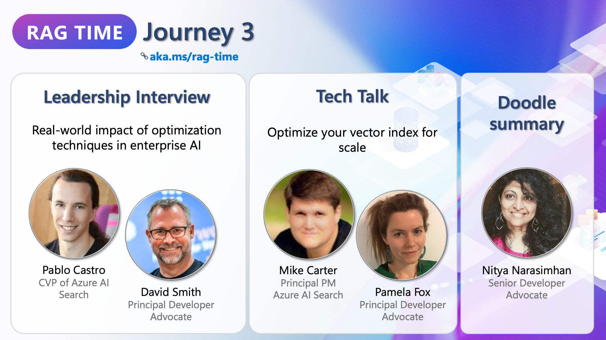
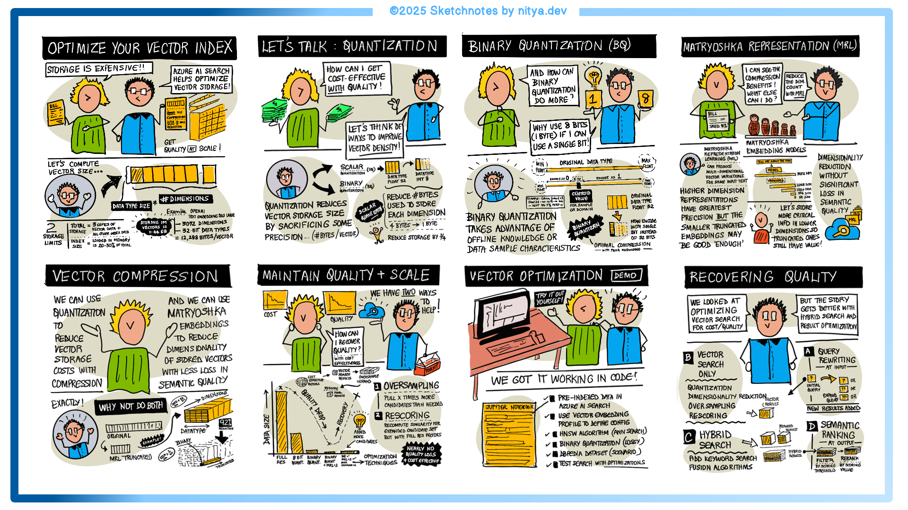

# Journey 3: Optimizing Your Vector Index for Scale

## Overview

Welcome to **Journey 3: Optimizing Your Vector Index for Scale**. This space is designed to help you understand how vector search optimization enhances efficiency, cost, and performance in AI applications.

In this journey, we explore techniques to reduce storage costs, improve retrieval speed, and balance quality with efficiency. You’ll learn how quantization, dimensionality reduction, oversampling, and re-scoring help developers build AI systems that scale effectively while maintaining accuracy.

**📅 March 19th, 9AM PT | 📺 [Watch the session](https://aka.ms/rag-time/journey3)**

## 🎥 Session Summary

### 🎥 Why Optimization Matters in AI Retrieval

Scaling AI applications isn’t just about adding more data—it’s about making retrieval faster, smarter, and more cost-effective. Optimizing vector indexes ensures that AI systems can store, retrieve, and process large datasets efficiently while maintaining high-quality responses. Azure AI Search provides powerful techniques like quantization, Matryoshka Representation Learning (MRL), and hybrid search to reduce storage while keeping retrieval performance high.

### 📚 Techniques for Scaling Vector Search

The size and precision of vector embeddings play a major role in AI efficiency. Quantization compresses vector data by reducing precision, cutting storage requirements by up to 96x without severely impacting retrieval accuracy. Dimensionality reduction through MRL further shrinks vector size while retaining meaning. Oversampling and re-scoring help refine results, ensuring AI still delivers high-quality responses even with compressed indexes. Combining these techniques allows developers to optimize for scale without compromising accuracy.

### 🖍 Doodle Summary

A visual summary of key takeaways is available to reinforce learning.

## 📂 Sample Code

To get hands-on experience, explore the sample implementation in the 📂 [Journey 3 Sample](./sample/) folder.

## 🔗 Additional Learning Resources

- 📖 Blog post
- 📚 Azure AI Search Documentation: [Learn more](https://learn.microsoft.com/en-us/azure/search/)

💬 Join the Discussion: Connect with the community in GitHub Discussions or open an issue in this repository.

🚀 Next Up: Continue to [Journey 4](./../Journey%204%20-%20RAG%20for%20All%20your%20Data%20Multimodal%20and%20Beyond/) for the next step—RAG for all your data, multimodal and beyond!